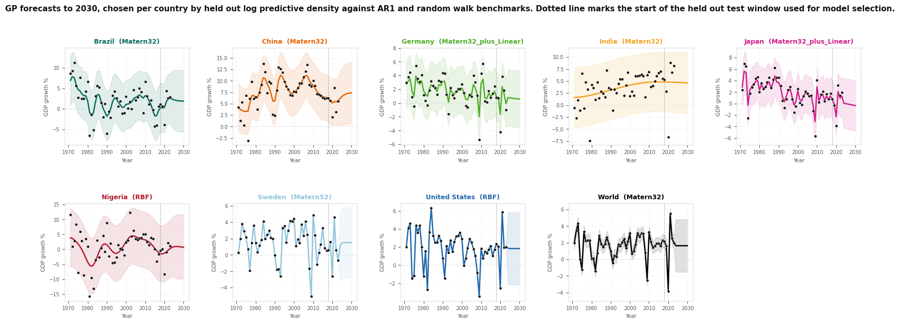

# GDP and CO2 Gaussian Process Forecasting

Held out validated Gaussian Process forecasting of GDP per capita growth and CO2 per capita across ten economies, extended to a coregionalized joint model that tests whether the two series carry usable shared structure.

## Problem Statement

The goal is to forecast annual GDP per capita growth out to 2030 for ten economies (United States, Germany, Japan, Sweden, China, India, Brazil, Nigeria, South Korea where available, and the World aggregate) using Gaussian Process regression, and to do so in a way that cannot be fooled by the most common failure mode in kernel comparison.

That failure mode is judging kernels by how well they fit the years they were trained on. A more flexible kernel almost always wins that comparison, because flexibility alone can absorb noise, so an in sample score rewards complexity rather than genuine forecasting skill. The earlier exploratory work fell into exactly this trap, spreading many separate experiments across scattered cells with a train and test boundary that could drift between sections.

This pipeline fixes that. Every model is scored only on years it never saw during fitting, using log predictive density, which rewards a model for assigning high probability to what actually happened and penalizes both wrong forecasts and overconfident ones. Each Gaussian Process is measured against two simple non GP benchmarks, an AR1 model and a random walk with drift, so a GP forecast is only treated as meaningful when it genuinely outperforms both.

A second question is whether GDP per capita growth and CO2 per capita share enough structure that modeling them together beats modeling them separately. This is tested with an intrinsic coregionalization model and the same held out scoring rule.

## Approach

* Hold out the six most recent years of every country series from all model fitting, using them only for scoring. The train and test boundary and the forecast horizon are centralized as single configuration values so they cannot drift between sections.
* Standardize each series before fitting so the GP optimizer converges reliably, then map predictions back to the original percentage scale for reporting.
* Score every model with one shared log predictive density function, applied only to held out years. This replaces the in sample training score used in the earlier notebook.
* Fit two non GP benchmarks per country, an AR1 model capturing simple mean reversion and a random walk with drift whose uncertainty widens further into the forecast, to give the GP models something honest to beat.
* Fit five candidate kernels per country: Matern32, Matern52, RBF (squared exponential), Matern32 plus Linear, and Matern32 plus White. Each is trained by maximizing the marginal likelihood, which balances fit against simplicity.
* Select per country whichever model scored best on the held out window. If a GP kernel wins, it is refit on the entire history to produce the final forecast, since the held out split was only needed to choose the kernel. If a benchmark wins, a plain Matern32 is still refit so a forecast band is produced, but a beats_benchmarks flag is set to false to mark that country's GP forecast as unproven.
* Generalize the single output pipeline so it runs on any column, then run it on CO2 per capita as well as GDP growth. The original GDP only functions are kept unchanged and the generic version is added alongside them.
* Fit one joint model per country using a Coregion kernel multiplied with a Matern32 kernel over time, the standard intrinsic coregionalization approach. GDP growth and CO2 per capita are stacked into a single dataset with an extra column marking which output each row belongs to, letting the model learn how strongly the two series covary. A single shared observation noise term is used across both outputs as a first pass simplification.
* Compare the joint model against the two independent single output models on the same held out years, separately for each series, to decide per country whether combining the two is worthwhile.

## Results

The forecast grid shows one panel per country. Each panel plots the observed history as points, the forecast mean and its 95 percent band running out to 2030, and a dotted vertical line marking where the held out test window began during kernel selection, so the split between genuine forecast and fitted history is visible at a glance. The chosen kernel name appears in each panel title.

The central finding is that a visually smooth, confident looking Gaussian Process forecast is not the same thing as a validated one, and the beats_benchmarks column is the only place that tells the difference. India is the clearest example. The chosen kernel was Matern32 with a long fitted lengthscale of roughly 28 years, producing a forecast that rises steadily to about 4.6 percent by 2030, and on its own that panel looks like the strongest result in the figure. Yet beats_benchmarks is false for India, with a held out log score of about negative 3.15, meaning that on the six genuinely withheld years the GP did not outperform either benchmark. The smooth rising curve is most likely just tracking India's recent multi year uptick, something a plain trend line reproduces just as well.

Across the grid, plain Matern32 or RBF kernels were chosen for most countries, with Matern32 plus Linear selected only for Germany and Japan. Added kernel flexibility rarely improved held out performance, even though more complex kernels often looked better when judged only on training data in the earlier exploratory notebook. That gap between in sample appearance and held out performance is exactly what this pipeline was built to expose. The shape of the uncertainty bands is also informative: for series like Sweden and the United States the band widens and flattens almost immediately past the last observed year, an honest signal that these series carry little year to year memory, while series such as Brazil, China, and Nigeria retain more curvature into the forecast region consistent with their longer fitted lengthscales.

The joint comparison is close to a clean negative finding. Across nine countries and eighteen total comparisons, the coregionalized joint model outperformed the independent single output model in only two cases, India's CO2 series and Nigeria's GDP series. Every other comparison favored keeping the two series separate, and in several cases the joint model did considerably worse rather than marginally worse. The clearest examples of the joint model actively hurting are Germany's CO2 series, where the held out score fell from about negative 1.57 independently to about negative 4.03 jointly, United States CO2, from about negative 0.96 to about negative 5.33, and India's GDP series, from about negative 3.15 to about negative 6.56. These are large gaps, indicating that forcing a single shared coupling parameter between GDP and CO2 imposed a relationship that does not hold well for those countries rather than simply failing to help. The two cases where the joint model helped are best treated cautiously rather than as strong evidence of shared structure.

The overall conclusion is that kernel flexibility and visual smoothness are not reliable indicators of genuine predictive skill in this dataset, and that GDP growth and CO2 per capita are, for almost every country here, best modeled separately. Before treating any country's 2030 forecast as meaningful, its beats_benchmarks value and held out log score should be checked first.

## Notebooks

1. `notebooks/wdi_gp_forecasting.ipynb`: full pipeline. Loads the cleaned World Development Indicators panel, fits the benchmarks and five candidate kernels per country with held out log predictive density scoring, selects and refits the best model, produces the ten panel forecast grid, generalizes the pipeline to run on CO2 per capita, fits the coregionalized joint model per country, and writes the joint versus independent comparison.

## Limitations and Next Steps

* The joint model uses a single shared observation noise term across both outputs. A per output noise model would be a more faithful test of shared structure and should be tried before drawing any final conclusion about coregionalization on this data.
* Model selection uses one fixed six year held out window per country. A rolling origin or multiple window evaluation would give a more stable estimate of forecasting skill and reduce sensitivity to whatever happened in those particular six years.
* Benchmarks are limited to AR1 and random walk with drift. Adding a small number of further simple baselines, for example an exponential smoothing model, would make the beats_benchmarks bar more demanding and more informative.
* The dataset is annual with roughly 53 observations per country, which is short for estimating long lengthscales reliably. The India Matern32 fit with a lengthscale near 28 years illustrates how a long lengthscale can arise without corresponding held out skill, so lengthscale values should not be read as structural findings on their own.
* A natural next step is to split the ten countries into two groups, those where a GP genuinely earned its place over both benchmarks and those where the forecast is not currently supported by held out evidence, and to report only the former as usable forecasts.
