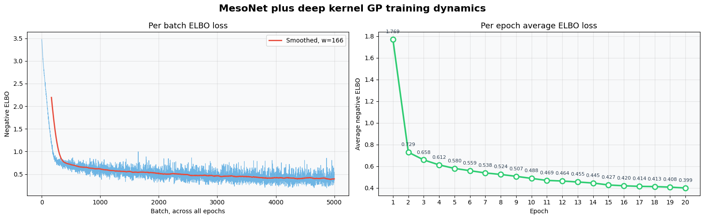
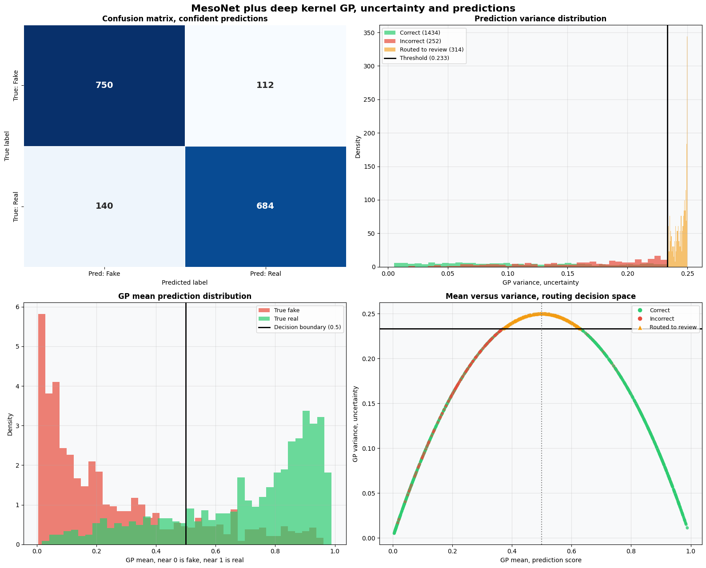

# MesoNet Deep Kernel GP Deepfake Detector

## Problem Statement

Detecting facial forgeries reliably requires more than a single confident
looking prediction, since a standard convolutional classifier can be
confidently wrong on images that look nothing like anything it saw during
training. This project pairs MesoNet, the compact convolutional network
from Afchar, Nozick, Yamagishi, and Echizen designed specifically for
facial video forgery detection, with a variational Gaussian process head
following the deep kernel learning approach of Wilson, Hu, Salakhutdinov,
and Xing. The Gaussian process layer outputs a calibrated variance
alongside every classification, which lets the system route uncertain
images to a human review queue instead of forcing a confident looking
answer on cases the model is not actually sure about. This notebook is a
direct successor to an earlier attempt that used a much larger ResNet18
backbone and suffered from a collapsed Gaussian process, and it
deliberately addresses each cause of that collapse.

## Approach

* Sourced the 140k real and fake faces dataset from Kaggle, taking eight
  thousand balanced training images, one thousand balanced validation
  images, and two thousand balanced test images, resized to 128 by 128.
* Built MesoNet, Meso-4 variant, from scratch as the feature extractor,
  four convolutional blocks of increasing filter count followed by a
  dense projection down to sixteen features, with no pretrained weights
  used anywhere in the pipeline.
* Attached a Gaussian process classification head with a radial basis
  function kernel wrapped in a scale kernel, with explicit interval
  constraints on both the lengthscale and the outputscale so neither
  hyperparameter can drift into the degenerate region that causes a deep
  kernel Gaussian process to collapse to a constant prediction.
* Initialized the two hundred fifty six inducing points from real feature
  vectors produced by a batch of actual training images, rather than from
  random points, so the Gaussian process starts from a representative
  region of the feature space.
* Trained the feature extractor, the Gaussian process layer, and the
  likelihood together with a single shared learning rate, avoiding the
  extreme learning rate imbalance between backbone and Gaussian process
  that previously prevented the two halves of the model from adapting
  together, with gradient clipping as an additional safeguard.
* Chose the variance threshold used to route predictions to the confident
  table versus the review queue from the eighty fifth percentile of the
  actual predictive variance distribution on a held out validation split,
  rather than an arbitrary fixed number.
* Evaluated the trained model on a held out test set, reporting accuracy,
  precision, recall, and F1 for confident predictions only, alongside a
  full uncertainty and routing analysis.

## Results

This figure shows the per batch and per epoch evidence lower bound loss
across training. The loss falls smoothly from 1.77 at the first epoch to
0.40 by the twentieth, a seventy seven percent reduction, with no flat or
unmoving region. This smooth convergence is the clearest evidence that
the feature extractor and the Gaussian process layer were adapting
together throughout training rather than the Gaussian process collapsing
to a constant output, which is exactly the failure mode this
architecture was redesigned to avoid.

This four panel figure summarizes model behavior on the two thousand
image test set. The confusion matrix shows balanced performance across
both classes rather than a bias toward one label. The prediction variance
distribution is close to bimodal, with a genuinely uncertain cluster of
predictions sitting near the maximum possible variance and a long tail of
confident predictions reaching toward zero, and the chosen threshold
falls in a sensible place along that distribution. The mean prediction
distribution and the mean versus variance routing scatter both show that
confident predictions cluster near the correct end of the scale for their
true class, while the review queue is capturing genuinely torn cases
rather than an arbitrary slice of the test set.

Overall, eighty four point three percent of test predictions were
confident, with eighty five point zero five percent accuracy among those
confident predictions, and the remaining fifteen point seven percent were
correctly routed to review rather than forced into a possibly wrong
confident answer.

## Notebooks

1. MesoNetGP.ipynb, containing the MesoNet feature extractor built from
   scratch, the constrained deep kernel Gaussian process head, training
   with a shared learning rate and gradient clipping, validation based
   variance threshold selection, and the full test set evaluation with
   uncertainty routing and a SQLite backed confident inference and active
   learning queue.

## Limitations and Next Steps

* This run used only eight thousand of the one hundred forty thousand
  available training images, images downsized to 128 by 128, twenty
  epochs, and training was run on CPU rather than GPU, so the reported
  accuracy is a reasonable result under deliberately modest compute
  rather than the ceiling of what this architecture can reach.
* The variance threshold is calibrated once from a single validation
  split, so its stability across different random validation splits has
  not been checked.
* A cross dataset distribution shift evaluation, testing the trained
  model against a separate, visually different deepfake dataset, was
  started in this notebook but not completed, and is a natural next step
  to check whether the calibrated uncertainty routing continues to behave
  sensibly outside the training distribution.
* Next steps include moving to a GPU runtime to train on more of the one
  hundred forty thousand available images for more epochs, and inspecting
  the images that landed in the active learning queue, both correct and
  incorrect confident predictions, to look for a common visual pattern,
  for example a particular forgery artifact or lighting condition, that
  the model consistently struggles with.
